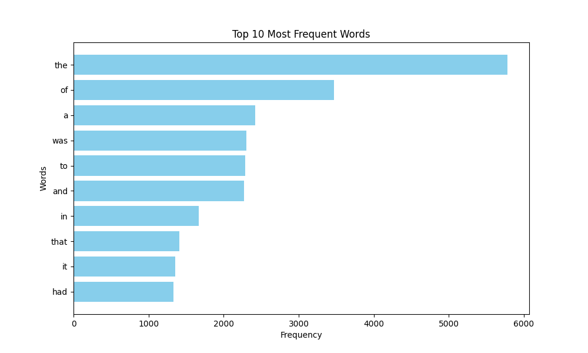
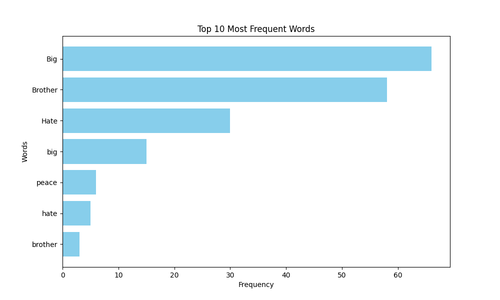

# Computer Systems hw-05

This repository contains the solutions to two tasks:

[Task 1: File Sorter](file_sorter.py)

[Task 2: Word Frequency Analysis with MapReduce](word_frequency.py)

## Task 1: File Sorter

This Python script is designed to read all files in the specified source folder and distribute them into subfolders in the destination directory based on their file extensions. The script performs asynchronous sorting for efficient processing of large numbers of files.

### Requirements

- **Python 3.7** or higher
- **aiopath** library (install via `pip install aiopath`)
- **aioshutil** library (install via `pip install aioshutil`)

### Usage

Run the script with the following command:

```bash
python3 file_sorter.py /path/to/source/folder /path/to/output/folder
```

### Functionality

1. Reads all files recursively in the source folder.
2. Copies each file to the corresponding subfolder in the output folder based on its file extension.
3. Logs any errors that occur during the process.

### Example

```bash
python3 file_sorter.py ./files ./output
2024-05-09 20:54:05,721 - INFO - Reading folder: files
2024-05-09 20:54:05,742 - INFO - Copied index.html to output/html
2024-05-09 20:54:05,753 - INFO - Copied index.js to output/js
2024-05-09 20:54:05,760 - INFO - Copied readme.txt to output/txt
2024-05-09 20:54:05,776 - INFO - Copied code.js to output/js
2024-05-09 20:54:05,786 - INFO - Copied page.html to output/html
```

## Task 2: Word Frequency Analysis with MapReduce

This Python script downloads text from a specified URL, analyzes the frequency of words in the text using the MapReduce paradigm, and visualizes the top words with the highest frequency in the text.

### Requirements

- **Python 3.7** or higher
- **httpx** module (install via `pip install httpx`)
- **matplotlib** module (install via `pip install matplotlib`)

### Usage

To run the script, execute the following command in your terminal:

```bash
python3 word_frequency.py
```

### Functionality

- **Text Download**: The script can download text from a specified URL using the `httpx` module.

- **Word Frequency Analysis**: The script implements the MapReduce paradigm to analyze the frequency of words in the text. It includes the following steps:

  - Mapping: The `map_function` assigns a count of `1` to each word encountered in the text.
  - Shuffling: The `shuffle_function` groups the mapped values by word.
  - Reducing: The `reduce_function` sums the counts for each word.

- **Visualization**: The `visualize_top_words` function visualizes the top words with the highest frequency using `matplotlib`. It generates a horizontal bar chart showing the frequency of each word.

- **Error Handling**: The script includes error handling to ensure robustness. It checks for HTTP response status codes to verify successful text retrieval from the URL. Additionally, it handles exceptions that may occur during the execution of asynchronous tasks.

- **Customization**: Users can customize the script by providing a list of search words. This allows them to analyze the frequency of specific words in the text.

- **Efficient Execution**: The script utilizes multithreading programming with ThreadPoolExecutor to efficiently handle text processing tasks. This ensures optimal performance, especially when dealing with large volumes of text data.

### Example

```bash
python3 word_frequency.py
Word frequency analysis result: {'Project': 6, 'Gutenberg': 6, 'Australia': 7, 'Title': 2, 'Nineteen': 3, 'eightyfour': 2, 'Author': 2, 'George': 2, 'Orwell': 2, 'pseudonym': 2, 'of': 3467, ... }
```

<p align="center"></p>

Specify search words in main function

`search_words = ['brother', 'Brother', 'Big', 'big', 'hate', "Hate", 'peace']`

```bash
python3 word_frequency.py
Word frequency analysis result: {'Hate': 30, 'big': 15, 'Big': 66, 'Brother': 58, 'peace': 6, 'brother': 3, 'hate': 5}
```

<p align="center"></p>
